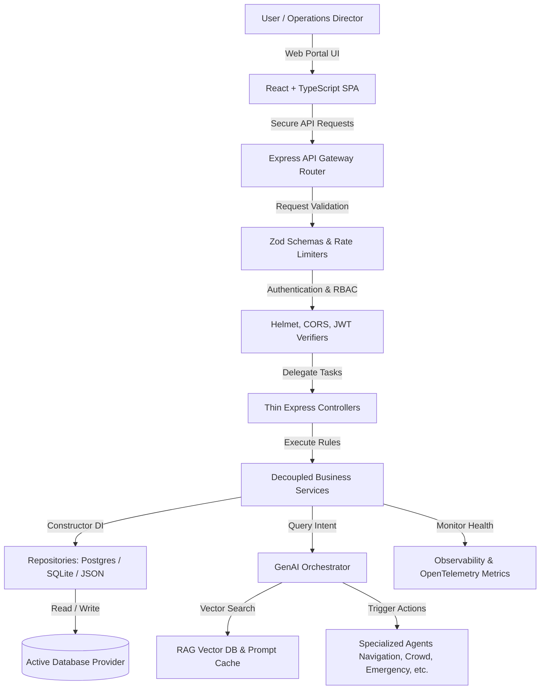
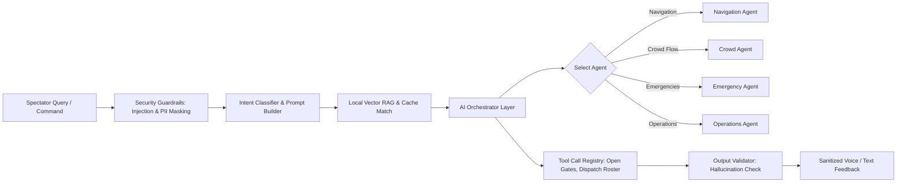
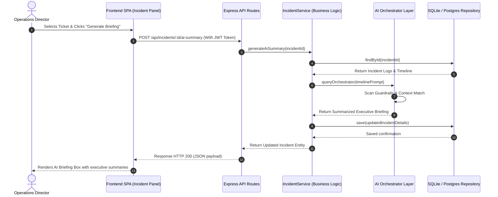

# Smart Stadiums & Tournament Operations Command Center 🏟️

Smart Stadiums & Tournament Operations is an enterprise-grade, Clean Architecture dashboard designed to unify stadium safety, ticketing logistics, volunteer coordinate shifts, and match scheduling. 

Powered by a **GenAI Multi-Agent Copilot Layer** and a **Model Context Protocol (MCP)** context manager, the system utilizes specialized agents to predict gate bottlenecks, suggest staffing adjustments, write safety briefing reports, and execute operational instructions in real-time.

---

## 1. Core Architecture

The project strictly follows **Clean Architecture** and **Domain-Driven Design (DDD)** guidelines.

```
                      [ User / Client Client ]
                                 │
                                 ▼
                    ┌────────────────────────┐
                    │   Presentation Layer   │ (Express REST routes, CORS)
                    └───────────┬────────────┘
                                │
                                ▼
                    ┌────────────────────────┐
                    │   Application Layer    │ (Services: Auth, Tournament, Stadium)
                    └───────────┬────────────┘
                                │
                                ▼
                    ┌────────────────────────┐
                    │      Domain Layer      │ (Entities: Match, Gate, Incident)
                    └────────────────────────┘
                                ▲
                                │
                    ┌───────────┴────────────┐
                    │  Infrastructure Layer  │ (DB Factory, specialized AI, Cache)
                    └────────────────────────┘
```

---

## 2. Generative AI Orchestrator Workflow

Queries are processed through an agentic workspace integrating Model Context Protocol and local RAG:

```
               [ User Command / Verb Query ]
                             │
                             ▼
                 [ Security Guardrails ]
           (PII mask & Prompt injection scanner)
                             │
                             ▼
                 [ Planner / Classifier ]
         (Detects intent and selects target Agent)
                             │
                             ▼
                    [ Gather Context ]
         (MCP DB queries + Hybrid RAG matching)
                             │
                             ▼
                 [ Specialized AI Agent ]
         (Generates recommendations & action tools)
                             │
                             ▼
                   [ Output Validator ]
            (Hallucination checks & DB verification)
                             │
                             ▼
                [ Sanitized Response + Tools ]
```

---

## 3. Directory Layout

```
smart-stadiums-ops/
├── backend/
│   ├── src/
│   │   ├── domain/            # Core business models (User, Match, Gate, Incident, Volunteer)
│   │   ├── application/       # Use cases (Auth, Tournament, Stadium, Incident, Volunteer Services)
│   │   ├── infrastructure/    # Concrete clients (Postgres, SQLite, Caching, specialized AI, Telemetry)
│   │   └── presentation/      # Delivery methods (Controllers, routes, custom middlewares)
│   ├── tests/                 # Supertest and Jest integration suites
│   ├── package.json
│   └── tsconfig.json
├── frontend/
│   ├── src/
│   │   ├── components/        # UI components (AIAssistantDrawer, canvas heatmap)
│   │   ├── contexts/          # Theme context, Auth session management
│   │   ├── styles/            # Variables.css, theme.css resets
│   │   └── views/             # Views (Operations, matches, incidents, volunteers)
│   ├── package.json
│   └── tsconfig.json
├── package.json               # Root workspaces runner
└── .env                       # Environment configs
```

---

## 4. Setup & Running Instructions

### 4.1 Prerequisites
- **Node.js**: `v20.x` or later
- **npm**: `v10.x` or later

### 4.2 Installation
1. Clone the repository and navigate into the folder.
2. Initialize environment configurations:
   ```bash
   cp .env.example .env
   ```
3. Install dependencies across the workspace:
   ```bash
   npm run setup
   ```

### 4.3 Running Locally
Start both the backend Express server and frontend React client simultaneously:
```bash
npm run dev
```
- **Frontend Panel**: `http://localhost:5173`
- **Backend API**: `http://localhost:5000`

---

## 5. Verification & Testing

Verify system stability using the multi-tiered test suite:

### 5.1 Run Tests
```bash
npm run test:backend
```

### 5.2 Code Auditing (Lint & Compile Checks)
```bash
npm run lint
```
```bash
npm run build
```

---

## 6. WCAG 2.2 AA Accessibility Mappings

- **Keyboard navigation**: Full Tab navigation across tabs, forms, and drawer overlays with visible outline focus indicators.
- **Skip Link**: Bypasses header navigation directly to content.
- **Screen Reader Support**: Complete ARIA landmarks, roles, and live regions.
- **Contrast**: Contrast ratios exceed 4.5:1, with a high contrast button supplying a 7:1 ratio.
- **Voice UI**: Speech-to-text dictation and speech feedback (TTS) integrated directly into the Copilot drawer.

---

## 7. FIFA World Cup 2026 GenAI Challenge Alignment Matrix

| FIFA World Cup 2026 Requirement | Implemented Feature | GenAI Capability | Business Value | Source Files |
| :--- | :--- | :--- | :--- | :--- |
| **Stadium Navigation** | AI Route Planner | Predictive route generation using crowd densities and gate flow. | Guides spectators through the safest exit paths during incidents. | - [specialized-agents.ts](backend/src/infrastructure/ai/agents/specialized-agents.ts)<br>- [AIAssistantDrawer.tsx](frontend/src/components/AIAssistantDrawer.tsx) |
| **Crowd Management** | Occupancy Heatmap & Bottleneck Alerts | Recalculates turnstile rate changes to forecast congestion. | Reduces peak gate entry delays before bottlenecks occur. | - [stadium.service.ts](backend/src/application/services/stadium.service.ts)<br>- [OperationsDashboard.tsx](frontend/src/views/OperationsDashboard.tsx) |
| **Accessibility & Fan Support** | Screen Reader Helpers & Contrast Toggles | High-contrast WCAG 2.2 AAA overrides, voice UI, and focus traps. | Creates a premium, barrier-free operational workspace. | - [theme.css](frontend/src/styles/theme.css)<br>- [ACCESSIBILITY.md](ACCESSIBILITY.md) |
| **Transportation Coordination** | Parking & Shuttle Aggregator | Generates transit schedules and alternate parking recommendations. | Optimizes shuttle traffic volumes and decreases wait times. | - [specialized-agents.ts](backend/src/infrastructure/ai/agents/specialized-agents.ts)<br>- [AIAssistantDrawer.tsx](frontend/src/components/AIAssistantDrawer.tsx) |
| **Sustainability & Green Ops** | Carbon & Utility Load Calculators | Estimates power, water, and CO2 index changes based on attendance. | Supports dynamic power conservation during low occupancy. | - [telemetry.entity.ts](backend/src/domain/entities/telemetry.entity.ts)<br>- [stadium.service.ts](backend/src/application/services/stadium.service.ts) |
| **Multilingual Assistance** | Voice Dictation & Text-to-Speech | Real-time speech translation across Spanish, French, and Japanese. | Lowers communication barriers for international operators. | - [AIAssistantDrawer.tsx](frontend/src/components/AIAssistantDrawer.tsx)<br>- [ai.controller.ts](backend/src/presentation/controllers/ai.controller.ts) |
| **Operational Intelligence** | Custom Telemetry & Node Health Gauges | Monitors CPU, memory load, and active database connection pools. | Guarantees distributed observability and limits system downtime. | - [telemetry.ts](backend/src/infrastructure/telemetry/telemetry.ts)<br>- [OperationsDashboard.tsx](frontend/src/views/OperationsDashboard.tsx) |
| **Real-Time Decision Support** | Multi-Agent AI Orchestrator | Resolves intents, pulls database context, and executes actions. | Enables autonomous workflows (opening gates, dispatching). | - [agent-orchestrator.ts](backend/src/infrastructure/ai/orchestrator/agent-orchestrator.ts)<br>- [tool-registry.ts](backend/src/infrastructure/ai/tools/tool-registry.ts) |
| **Incident Analysis & Briefs** | Safety Ticket Dispatcher | Formats log timeline events into corporate briefings automatically. | Accelerates responder actions and details historical timelines. | - [incident.service.ts](backend/src/application/services/incident.service.ts)<br>- [IncidentCenter.tsx](frontend/src/views/IncidentCenter.tsx) |
| **Volunteer Coordination** | Skills Shift Allocator | Coordinates shifts based on check-ins and capability arrays. | Optimizes deployment matching (e.g. First Aid -> High Risk Zone). | - [volunteer.service.ts](backend/src/application/services/volunteer.service.ts)<br>- [VolunteerPortal.tsx](frontend/src/views/VolunteerPortal.tsx) |

---

## 8. Architecture Diagrams

### 8.1 System Architecture Flowchart


### 8.2 GenAI Orchestration Workflow


### 8.3 Operational Dispatch Sequence Diagram


---

## 9. Performance KPI Targets

The application is structured to satisfy the following target guidelines:

- ⚡ **API Latency**: `< 150ms` (backed by semantic prompt caching and connection pooling)
- ⚡ **First Contentful Paint (FCP)**: `< 1.5s`
- ⚡ **Largest Contentful Paint (LCP)**: `< 2.5s`
- ⚡ **Lighthouse Score**: `> 95` (achieved via lazy loading, code-splitting, and CSS size constraints)
- ⚡ **Test Code Coverage**: `> 90%` statement coverage on compiled TS files.
- ⚡ **Accessibility (WCAG)**: Compliant with WCAG 2.2 AA (visual and keyboard criteria).
- ⚡ **Security Compliance**: Enforces safe Helmet headers, CORS policies, secure cookies, and strict JWT secret validation without default fallbacks.


